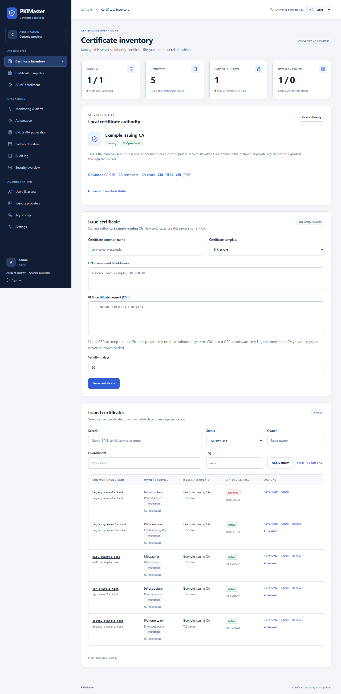
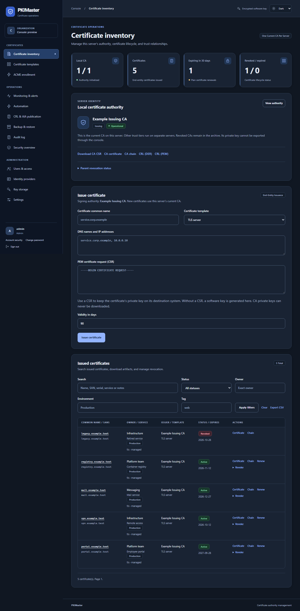
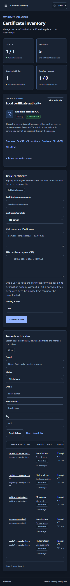

# PKIMaster

[](https://github.com/BartelLuis/PKIMaster/actions/workflows/ci.yml)
[](https://github.com/BartelLuis/PKIMaster/actions/workflows/security.yml)
[](https://github.com/BartelLuis/PKIMaster/actions/workflows/debian.yml)
[](#development-and-verification)
[](#install-with-apt)

**Private PKI for Debian, managed entirely through your browser.**

PKIMaster is a private PKI for Debian 13, installed as an APT package and configured through the browser. By default each dedicated server runs one current Root, Intermediate, or Issuing CA and retains revoked CAs as history. Optional MultiCA mode permits multiple independent local CAs; parent and child trust tiers still run on separate servers. Choose local, LDAP or OpenID Connect authentication with mandatory MFA, and encrypted software keys, PKCS#11/SoftHSM or Azure Key Vault for CA signing. Independent approval of subordinate CA requests, explicit roles and authenticated audit chains protect administration.

**BSI is the target operating baseline, not a certification claim.** See the [BSI readiness matrix and remaining gaps](docs/BSI-READINESS.md) before evaluating production use. Approved hardware selection, complete separation of trusted roles, protected external audit retention and operational certification remain deployment requirements.

## New in 0.5.0

Version 0.5.0 is the stable release of the tested release-candidate features,
with optional MultiCA management:

| Area | What you can do |
| --- | --- |
| Four-eyes approvals | Optionally require a different MFA-enrolled administrator to approve sensitive changes, including user access and backup export. |
| CA rollover | Rekey subordinate and root CAs on separate servers and overlap old and new trust paths during migration. |
| Backup provenance | Sign manual and scheduled encrypted backups; verify the Ed25519 signer against a fingerprint retained independently before recovery. |
| Passkeys | Optionally use WebAuthn passkeys as a phishing-resistant second factor, while retaining the required TOTP/recovery fallback. |
| SCEP and EST | Optionally enable credential-scoped device enrollment under certificate-template and domain constraints. Both protocols are disabled by default. |
| MultiCA | Optionally manage multiple independent local CAs, select an Issuing CA for issuance and renewal, and configure a default CA for integrations. |

Four-eyes approval, SCEP/EST and MultiCA are opt-in. Read the operational limits and
rollout procedures in [approvals](docs/APPROVALS.md), [CA rollover](docs/CA-ROLLOVER.md),
[backup and recovery](docs/BACKUP.md), [passkeys](docs/PASSKEYS.md) and
[SCEP/EST](docs/SCEP-EST.md) before enabling them. This project targets a BSI
operational baseline and does not claim certification.

## New in 0.4.0-1

| Area | What you can do |
| --- | --- |
| Parent CRLs | Schedule verified parent-CRL downloads, with signature, freshness and rollback checks. |
| Certificate templates | Define allowed DNS domains, IP networks, wildcards, lifetimes and roles; enforce the same policy during issuance and renewal. |
| Inventory | Record owners, services, deployment locations, environments, tags and notes; search SANs and serials, filter results and export CSV. |
| Scheduled backups | Deliver encrypted snapshots to SFTP, retain a chosen number and monitor overdue jobs. Keep the private recovery key outside the CA. |
| External audit archive | Deliver verified audit records and checkpoints to a separate SFTP archive and detect conflicting retained history. |
| Deployment checks | Verify the certificate actually served by a configured TLS endpoint, including hostname, chain, fingerprint and expiry. |
| ACME | Enroll approved clients using one-use external account binding; issue and renew through HTTP-01 or DNS-01 under certificate-template policy. |
| Console | Use the redesigned responsive interface in Light, Dark or System mode, with a saved per-browser preference. |

Automation and ACME are disabled until configured. See [automation and recovery-key setup](docs/AUTOMATION.md), [ACME client setup](docs/ACME.md) and [monitoring](docs/MONITORING.md).

## Optional MultiCA mode


MultiCA is disabled by default. An administrator enables it in **Settings**, then can create and manage multiple independent local CAs. Certificates, CRLs, audit history and signing keys remain bound to the selected CA. Certificate issuance and renewal let an administrator choose an active Issuing CA. Select a default local CA in **Settings** for integrations or other operations that do not carry an explicit CA ID; if no valid default is configured, those operations fail closed. MultiCA does not host a local Root → Intermediate → Issuing hierarchy: parent CAs still run on separate servers and exchange CSRs, signed certificates, public chains and CRLs. Parent servers retain only the public certificates they issue for remote CAs. Standalone CA private-key downloads are forbidden; encrypted disaster-recovery backups include locally stored CA material.

Without MultiCA, revoke the current CA before initializing a replacement on the same host. With MultiCA, new CAs can be initialized alongside existing ones. The **Revoked CA archive** retains revoked authorities, their issued certificates, signing requests and public download URLs. Each new CA gets its own identity and key; existing certificates stay associated with their original issuer. Revocation remains permanent. Continue distributing each CA's CRL and arrange parent revocation or removal of root trust as appropriate.

To remove a revoked CA permanently, select **Delete CA** in the **Revoked CA archive** and type its exact display name to confirm. Only administrators can delete a revoked CA. Deletion removes the CA and its associated issued certificates, CA signing requests, CRLs, locally stored keys and archived provider credentials. Its local certificate and CRL download URLs stop working, and its display name becomes available for reuse. Audit records remain. External HSM/Azure keys, previously uploaded publication files and backup copies are not deleted automatically. An undeleted archived CA continues to reserve its display name.

Configure separate CRL/AIA publication URLs and SFTP directories for each CA before enabling uploads. The current automatic SFTP publisher is assigned to one CA at a time; other CAs remain available at their CA-specific PKIMaster artifact URLs. Preserve revoked CAs' public files and URLs for existing certificates.

Use the [browser workflow and migration instructions](docs/BSI-READINESS.md#browser-workflow) to establish the hierarchy. At least two administrator accounts on each signing parent are required: one submits the child CSR and another approves it. On the child, import the signed certificate, public parent chain and current signed parent CRLs; verify the root fingerprint through a trusted channel. Missing or stale parent CRLs block signing.

## Screenshots

Captured from the **0.4.0-1** console on **2026-09-28**, with fictional demo data, one local Issuing CA and five issued certificates. The parent Root is represented only by its public chain and signed CRL. These are unedited browser captures; image filenames include a content fingerprint.



<details>
<summary>Dark mode</summary>

The theme selector is available on the console and sign-in pages. Light is the default; System follows the operating system's preference. The choice stays in this browser.



</details>

<details>
<summary>Mobile console</summary>

Navigation opens from the menu button; wide tables scroll within their own panel. Forms, keyboard focus and status messages adapt to both themes.



</details>

## Install with APT

The recommended installation on **Debian 13 (trixie)** uses the signed [bartel.sh / packages repository](https://repo.bartel.sh/). It provides package indexes for amd64 and arm64; APT installs the latest published PKIMaster version and receives future updates through the same source.

```sh
sudo apt update
sudo apt install ca-certificates curl gnupg
curl -fsS https://repo.bartel.sh/bartel-archive-keyring.asc -o bartel-archive-keyring.asc
gpg --show-keys --with-fingerprint bartel-archive-keyring.asc
```

Verify the primary signing-key fingerprint before installing the key:

```text
23A3 F000 3408 5B52 4AFF 37AD 54C9 00D3 A467 A19F
```

Then install the key and Debian-specific source:

```sh
sudo install -d -m 0755 /etc/apt/keyrings
sudo install -m 0644 bartel-archive-keyring.asc /etc/apt/keyrings/bartel-archive-keyring.asc
curl -fsS https://repo.bartel.sh/sources/trixie.sources -o bartel.sources
sudo install -m 0644 bartel.sources /etc/apt/sources.list.d/bartel.sources
sudo apt update
sudo apt install pkimaster
```

The source limits trust to this repository's key using `Signed-By` and stays on `trixie`. For a future Debian upgrade, use the matching suite once it is listed on the repository website. Available package versions and a specific download can be selected with:

```sh
apt list --all-versions pkimaster
apt download pkimaster=0.5.0-1
```

Alternatively, download the `.deb` from [GitHub Releases](https://github.com/BartelLuis/PKIMaster/releases/latest): [`pkimaster_0.5.0-1_all.deb`](https://github.com/BartelLuis/PKIMaster/releases/download/v0.5.0/pkimaster_0.5.0-1_all.deb). Release assets also include `SHA256SUMS` and build metadata. All published release files are also available in the [repository download archive](https://repo.bartel.sh/releases/pkimaster/). From the download directory:

```sh
sudo apt update
sudo apt install ./pkimaster_0.5.0-1_all.deb
```

To build from source, run the following from a checkout on Debian 13 (the build runs the application tests):

```sh
sudo apt update
sudo apt install build-essential debhelper python3 python3-flask python3-cryptography python3-werkzeug gunicorn python3-jwt python3-ldap3 python3-requests python3-asn1crypto python3-paramiko python3-segno python3-dnspython python3-fido2 python3-pykcs11 softhsm2
sh scripts/build-deb.sh
sudo apt install ./dist/pkimaster_0.4.0-1_all.deb
```

The package installs a systemd service running as the dedicated `_pkimaster` system user. Python dependencies come from Debian; installation does not run pip or download Python packages. Both installation methods resolve dependencies using your configured Debian repositories.

The service initially listens on **https://127.0.0.1:8443** and generates its own local HTTPS certificate. For a remote machine, connect through an SSH tunnel:

```sh
ssh -L 8443:127.0.0.1:8443 administrator@pki-server
```

Open **https://localhost:8443/setup** in your browser. The initial certificate is self-signed, so the browser will ask you to trust it. Use a local connection or an SSH connection to a server whose host key you have verified for initial setup.

Create the first administrator and organization through the setup page. There are no default credentials. Setup accepts only loopback connections and closes permanently after the first administrator is created. All users must enroll a SHA-256 TOTP authenticator (six digits, 30 seconds) before accessing the PKI. Scan the enrollment QR code or copy the complete `otpauth://` URI into your authenticator, including Bitwarden, so it uses the correct algorithm and settings. Then open **Account security** and generate recovery codes with a fresh authenticator code. Store the codes separately: they are shown once, and each can be used once after your normal sign-in to enroll a replacement authenticator.
For later accounts, the creating administrator receives a short-lived setup key and must transfer it to the user over a separate protected channel; a password-authenticated browser cannot retrieve it.

## Web-only configuration

Use **Settings** for organization, publication URL, certificate lifetime limits, CRL lifetime, session timeout, private-key export policy, listen address, HTTPS port, and HTTPS certificate/key upload. New installations need no environment variables, editable configuration files, or configuration CLI.

Use the theme selector for **Light**, **Dark** or **System** appearance. Navigation groups certificate work, operations and administration; the mobile menu supports keyboard navigation and Escape. Theme changes affect this browser only and are available before sign-in.

Use **Authentication** to select local accounts, LDAP (LDAPS or mandatory StartTLS) or OIDC (authorization code flow with PKCE). Administrators provision external users with their exact LDAP DN or OIDC issuer and subject; provider claims cannot create accounts or grant roles. Every provider still requires application TOTP. A separately enabled local administrator sign-in supports recovery from a provider outage. Changing authentication revokes existing sessions. See [identity and key-provider setup](docs/PROVIDERS.md).

Use **Key storage** before initializing the CA to choose encrypted software keys, PKCS#11/SoftHSM or Azure Key Vault. SoftHSM tokens can be initialized through the browser. Azure supports software-backed RSA and hardware-backed RSA-HSM, with an exact key version and public-key fingerprint pinned to the CA. Credentials are encrypted and can be replaced after proving access to the same key. The provider cannot be changed for an existing CA, and a provider outage never falls back to a software key.

The listener initially binds to loopback. To enable remote access, upload a trusted server certificate and matching unencrypted PEM key, then choose the server's IP address or `0.0.0.0`/`::` and an unprivileged port (1024–65535). The packaged service applies listener and TLS changes automatically within a few seconds; reconnect at the saved address and port. Firewall and DNS administration remain part of the host/network deployment.

Use **CRL & AIA publication** to configure public CRL and issuer-certificate URLs and an optional **SFTP destination**. PKIMaster pushes `ca.crl` (DER), `ca.cer` (DER) and `chain.pem` into a dedicated remote directory. The destination web server serves these public files over HTTP(S); SFTP is the upload transport. Pin the SSH host key and use a dedicated password or SSH key, stored encrypted through the browser. No CA private keys leave the signing provider. See the [SFTP setup and operating guide](docs/PUBLICATION.md).

New subordinate and end-entity certificates embed the configured CRL distribution point and CA Issuers AIA URL. Without overrides, the public base URL supplies `/crl/<authority-id>.crl` and `/aia/<authority-id>.cer`, both accessible without login. AIA returns the signing issuer's certificate. Changing URLs affects future certificates only; keep older locations available for existing certificates.

The APT package includes a publication timer that checks every minute. Revocations queue an updated CRL, and enabled publication renews CRLs before expiry even without browser traffic. Uploads use temporary files and atomic replacement, with the CRL replaced last. Failed uploads remain queued with bounded retry delays and visible status; revocation remains committed locally. Automatic publication requires the CA host and signing provider to be online. Offline Roots need scheduled ceremonies before CRL expiry.

Use **Automation** to schedule parent-CRL retrieval, encrypted backups and external audit delivery. Each job has its own interval and last-success/error status. The automation timer checks due jobs every five minutes; failures retry with backoff and appear in Monitoring. Configuration changes and manual runs require a fresh TOTP code. See the [automation guide](docs/AUTOMATION.md) for recovery keys, SFTP setup, retention and trust boundaries.

## Certificate management

- Renew from the inventory or certificate details. CN, SANs and profile are prefilled; review them, provide a new CSR or explicitly generate a new key, and issue a linked successor. The previous certificate remains unchanged. Details link both generations; repeated submission cannot create a second successor. Renewal uses the current Issuing CA and its normal validity, key-strength and parent-CRL checks. Revoked certificates require a new issuance instead.
- One local Root, Intermediate, or Issuing CA per dedicated server, with CSR-based external signing. New CA certificates and CSRs omit `pathLenConstraint`.
- **Certificate templates** provide TLS server, TLS client or combined purposes with default/maximum lifetimes, permitted DNS suffixes, IP networks, wildcard rules and allowed roles. The server validates the current template during issuance and renewal and retains its policy snapshot with the certificate. Template changes affect future issuance; existing certificates are unchanged.
- Sign an existing PEM CSR to keep its private key outside the service, or generate an RSA4096 key. CSR signatures and key strength are checked, and arbitrary requested extensions are not copied.
- Issued validity never exceeds issuer validity or the configured leaf lifetime limit. Expired, revoked, or not-yet-valid ancestors block issuance.
- Certificate and subordinate CA revocation with reasons, signed DER CRLs, monotonically increasing CRL numbers, and cache invalidation on revocation.
- Disabling the local CA stops its signing. Revoke a subordinate on its parent server and distribute the new CRL. Remove a distrusted root from relying-party trust stores. Import parent CRLs manually or enable verified scheduled retrieval in Automation; disconnected servers still cannot learn new revocations until retrieval succeeds.
- **Ownership & deployment** records an owner/team, service, deployment location, environment, tags and notes. Search names, SANs, serials and metadata; filter by status, owner, environment or tag and export the filtered inventory as CSV. Renewal copies ownership and moves an enabled TLS deployment check to the successor.
- Certificate and chain downloads, paginated inventory, and expiry counts. Generated end-entity key exports are disabled by default, restricted to administrators when enabled, and audited. Standalone CA key downloads are forbidden; local CA material is included only in encrypted complete-state backups.

Path-length limits already present in parent certificates are enforced against the actual CA chain. Existing signed certificates retain their limits; removing them requires reissuance.

Revocation is permanent in this version, including the `certificate_hold` reason. Relying parties must be configured to check CRLs; publication alone does not make clients enforce revocation. CRLs are refreshed on request and by the enabled SFTP publication timer, and cannot be signed by expired CAs.

## ACME enrollment and renewal

Enable **ACME enrollment** on an active Issuing CA to expose `https://your-pki-host/acme/directory`. An administrator creates a server certificate template permitting the `acme` role and an enrollment credential restricted to its allowed DNS names. Each external account binding (EAB) credential can enroll one account and expires after seven days. Existing accounts authenticate with their own signing keys; they do not use browser sessions or TOTP.

Clients prove control with **HTTP-01** or **DNS-01**; wildcards require DNS-01. The client generates and retains its certificate private key and submits a CSR. Template policy, ancestor validity and parent CRLs are checked before issuance. Use the ACME client's renewal timer and service-specific deployment hook; PKIMaster does not install certificates on destination systems. See [ACME setup and the Certbot example](docs/ACME.md) for DNS restrictions, network policy and supported resources.

## Monitoring and recovery

**Monitoring & alerts** reports expiring certificates, CA chains, parent CRLs, publication problems and failed/overdue automation jobs. The Debian monitoring timer runs every five minutes and independently retrieves configured public CRL URLs to check reachability, signature and freshness. Administrators can configure warning thresholds and encrypted SMTP or HTTPS webhook credentials. Notifications are disabled until configured; repeated unchanged findings are deduplicated and resolutions are reported.

On a certificate's **Ownership & deployment** page, an administrator can enable a TLS endpoint check with connection host, port and optional SNI hostname. Monitoring verifies the presented chain, hostname, validity and certificate fingerprint and records its last observation. After renewal it checks for the successor, so a service still using the predecessor is visible as a mismatch. Direct TLS services such as HTTPS and LDAPS are supported; STARTTLS is not. See the [monitoring guide](docs/MONITORING.md) for network restrictions and delivery behavior.

**Backup & restore** exports a passphrase-encrypted snapshot of the database, encryption secrets, audit records, HTTPS identities and managed local SoftHSM state. Export requires administrator access and a fresh TOTP code. On a fresh host, use **Restore a backup** from initial setup through localhost or an SSH tunnel. Stop the source host first; the packaged supervisor validates and installs the snapshot with web workers stopped. The CA identity is preserved, while existing browser sessions are invalidated. External HSM/Azure keys require their provider's recovery process. See the [backup and restore guide](docs/BACKUP.md) for limits and recovery verification.

**Scheduled backups** use a separate recovery public key and SFTP destination. Generate and download the private recovery key in your browser, retain it outside the CA, then save only its public key in Automation. Restore with the matching private key on a fresh host. Recipient encryption protects confidentiality and archive integrity; it does not independently prove who produced an archive. Use a trusted backup source and independently retained verification evidence as described in [the automation guide](docs/AUTOMATION.md).

**Account security** supports one-use recovery codes and authenticator replacement. Changing authenticators requires a fresh current code, or normal sign-in followed by an unused recovery code. The previous authenticator stays active until the replacement is verified. Completing replacement invalidates previous sessions and recovery codes and shows a fresh recovery set once. Password resets do not remove MFA.

## Administration and security

| Role | Permissions |
| --- | --- |
| Administrator | Manage CAs, certificate templates, ACME enrollment, automation, endpoint checks, users and settings; issue/revoke certificates, permanently delete revoked CAs, view audit history and export end-entity keys when policy allows |
| Operator | Issue/renew/revoke end-entity certificates within permitted templates, maintain certificate metadata, and view inventory, monitoring and audit history |
| Auditor | View inventory, public certificate/chain downloads, and audit history |

Administrators create and deactivate accounts and reset local passwords in **Users**. Local users can change their own password; external passwords remain managed by the identity provider. Deactivation and password changes invalidate existing sessions; the last enabled administrator able to use the selected authentication mode cannot be deactivated. Sessions use secure cookies in the packaged service, all forms require CSRF protection, and password and TOTP failures are throttled in shared persistent storage. Successful TOTP codes cannot be replayed; password reset retains MFA.

CA and generated certificate keys are encrypted at rest using an installation-specific secret. Session and encryption secrets are generated separately, stored with private file permissions, and preserved across restarts and package upgrades. Startup fails if an existing database's encryption secret is missing or incompatible. The independent HTTPS server identity is stored in a private PEM file so the service can start unattended.

Audit records cover setup, authentication, users, policy changes, issuance, revocation, CRL publication, and private-key exports. Records form a SHA-256 chain authenticated with HMAC and protected by append-only database guards. Startup and mutations verify integrity; **Security posture** exports verified evidence and checkpoints for independent retention. Older records are sealed at migration, which cannot establish their earlier integrity. The local store is **not tamper-proof against a host administrator with application secrets**; retain checkpoints off-host to detect rollback.

**Automation** can deliver complete verified audit archives to SFTP using immutable filenames and read-back verification. Previously retained checkpoint hashes are compared with local history to detect a rollback or fork. PKIMaster does not delete those audit archives; ordinary SFTP storage still requires independent permissions, protected retention or WORM controls. Transporting evidence alone does not establish trusted timestamps or a BSI-assessed operating process.

## Operations and backups

```sh
sudo systemctl status pkimaster
sudo journalctl -u pkimaster
sudo systemctl status pkimaster-publication.timer
sudo journalctl -u pkimaster-publication.service
sudo systemctl status pkimaster-monitoring.timer
sudo journalctl -u pkimaster-monitoring.service
sudo systemctl status pkimaster-automation.timer
sudo journalctl -u pkimaster-automation.service
```

State lives in `/var/lib/pkimaster`, including the SQLite database, `runtime-secrets.json`, `server-tls/` and optional `softhsm/` tokens. Prefer **Backup & restore** or configured scheduled encrypted snapshots. For a manual file-level backup, stop all three timers, active workers and the web service. The database alone cannot recover encrypted keys, provider credentials or MFA secrets. External HSM/Azure keys require the provider's separate backup, retention and recovery procedures. Protect manual archives as CA key material:

```sh
sudo systemctl stop pkimaster-publication.timer pkimaster-monitoring.timer pkimaster-automation.timer
sudo systemctl stop pkimaster-publication.service pkimaster-monitoring.service pkimaster-automation.service pkimaster
sudo sh -c 'umask 077; tar -C /var/lib -czf /root/pkimaster-backup.tar.gz pkimaster'
sudo systemctl start pkimaster pkimaster-publication.timer pkimaster-monitoring.timer pkimaster-automation.timer
```

Restore the complete directory with ownership `_pkimaster:_pkimaster`, directory mode `0700`, and private file modes before starting the service. Package removal and purge deliberately retain the state directory and its system user to avoid destroying CA keys.

Existing **single-CA** source installations can be upgraded in place using their original database and encryption secret. Multi-CA installations are blocked and require a reviewed migration before upgrading; see [migration boundaries](docs/BSI-READINESS.md#existing-installations-and-migration). The first upgraded startup imports legacy secrets from the original environment or development secret files and persists them; it never silently replaces encryption secrets. Schema changes are additive. Moving an existing installation into the Debian service is an explicit migration: stop the old service, back up and migrate its complete state into `/var/lib/pkimaster`, and restore ownership before enabling the packaged service. Do not generate a new encryption secret for existing CA data.

## Development and verification

```sh
python3 -m venv .venv
. .venv/bin/activate
pip install -e .
pkimaster-dev
python -m unittest discover -s tests -v
```

Development serves HTTP only on `127.0.0.1:8000`, with its own local `instance/` state. Use the packaged HTTPS service for deployment.

`scripts/smoke-deb.sh` exercises package installation, HTTPS startup, reinstall, removal, and purge on a **disposable Debian 13 machine**. It refuses to run against an existing PKIMaster installation or state directory. CI builds the `.deb`, runs the tests, and performs this smoke check.

## GitHub automation

The workflows under `.github/workflows/` provide these checks on pull requests and pushes to `main`, with manual runs available in the Actions tab:

| Workflow | Checks and artifacts |
| --- | --- |
| Python CI | Tests on Python 3.11–3.14 on Linux and Python 3.14 on Windows, coverage reports, Python correctness checks, workflow/Dependabot schema validation, actionlint, ShellCheck, wheel/source builds, and installation outside the checkout |
| Security | CodeQL analysis of Python and GitHub Actions, plus separate strict vulnerability audits of application and CI dependencies |
| Debian package | Debian 13 build and complete test suite, package metadata/file/permission checks, HTTPS installation and upgrade smoke tests, `.deb`/build metadata/checksums, and diagnostic logs |

Python CI and Security also run weekly. Actions are pinned to full commit SHAs, checkout credentials are not persisted, and token permissions are limited per workflow/job. Checks run on ordinary pull requests, including Dependabot and fork pull requests, without requiring project secrets. The workflows build artifacts; they do not publish releases or deploy the service.

`.github/dependabot.yml` checks GitHub Actions every Monday at 06:00 and Python dependencies at 06:30, Europe/Berlin time. It covers `pyproject.toml` and the pinned tools in `requirements-ci.txt`, groups compatible minor/patch updates, and keeps major version updates separate. Security updates have their own Python group. Debian's Python packages continue to receive updates through APT rather than Dependabot.

To activate these checks, merge the workflow and Dependabot files into the default branch and ensure Actions is enabled. Use CodeQL advanced setup for `security.yml`; disable an existing CodeQL default setup first. Public repositories can use CodeQL, while private repositories require the appropriate GitHub Code Security entitlement. Enable Dependabot alerts and security updates in repository settings to receive alert-driven fixes as well as scheduled version updates. See [GitHub's Dependabot configuration reference](https://docs.github.com/en/code-security/reference/supply-chain-security/dependabot-options-reference) and [CodeQL setup documentation](https://docs.github.com/en/code-security/code-scanning/enabling-code-scanning/configuring-advanced-setup-for-code-scanning).

Install local CI tooling with `python -m pip install -r requirements-ci.txt`. The package maintainer contact in both Python and Debian metadata is `maintainers@pkimaster.de`.

## Current scope

This is a developing private PKI with separate CA hosts. It is not BSI-certified or a complete implementation of TR-03145. [The readiness matrix](docs/BSI-READINESS.md) records implemented controls and blocking gaps, including qualification of HSM deployments, comprehensive dual control, protected external audit retention, operational governance, recovery and independent assessment. Controlled ACME enrollment, optional parent-CRL synchronization, scheduled encrypted backups, external audit delivery and deployed TLS checks are implemented. SCEP/EST, OCSP, CA rollover and high availability remain outside the current implementation. Client trust distribution, certificate deployment, offline-Root ceremonies and independent archive protection remain deployment responsibilities.
