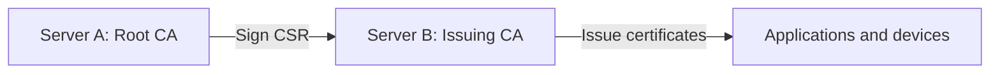
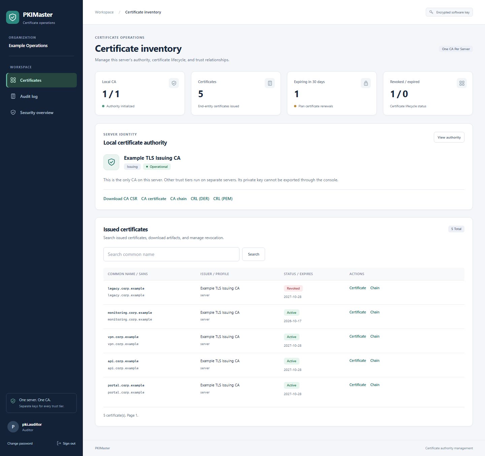
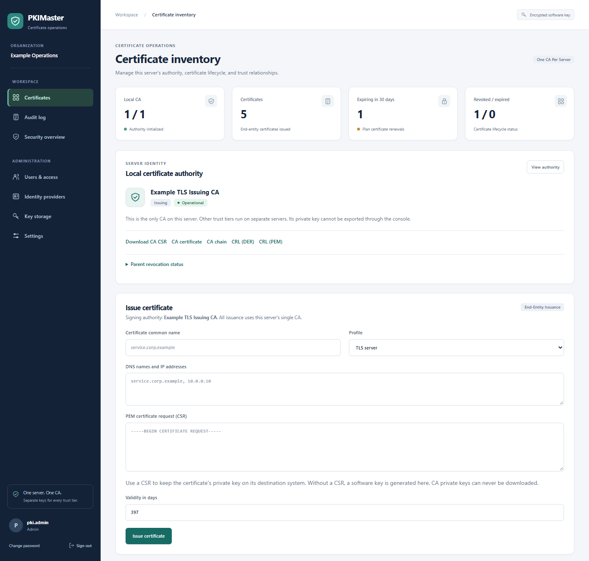
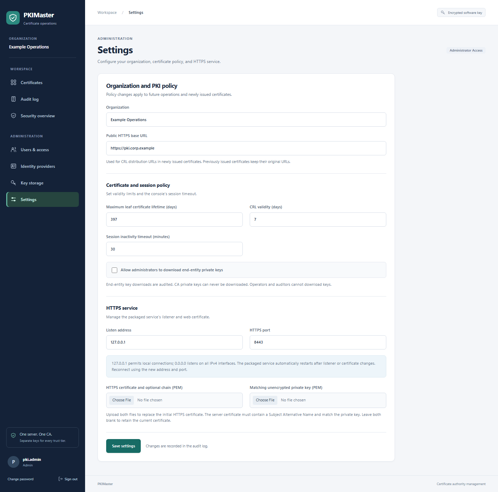
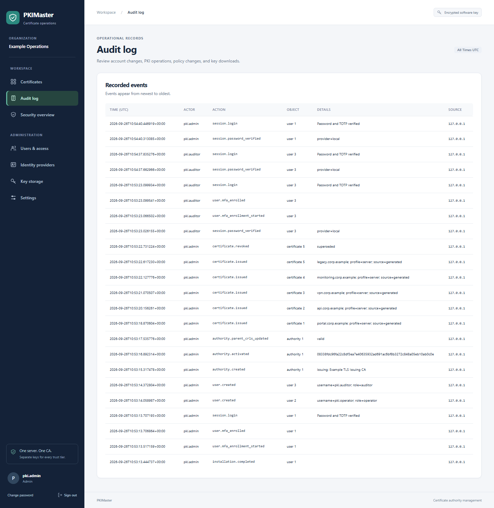
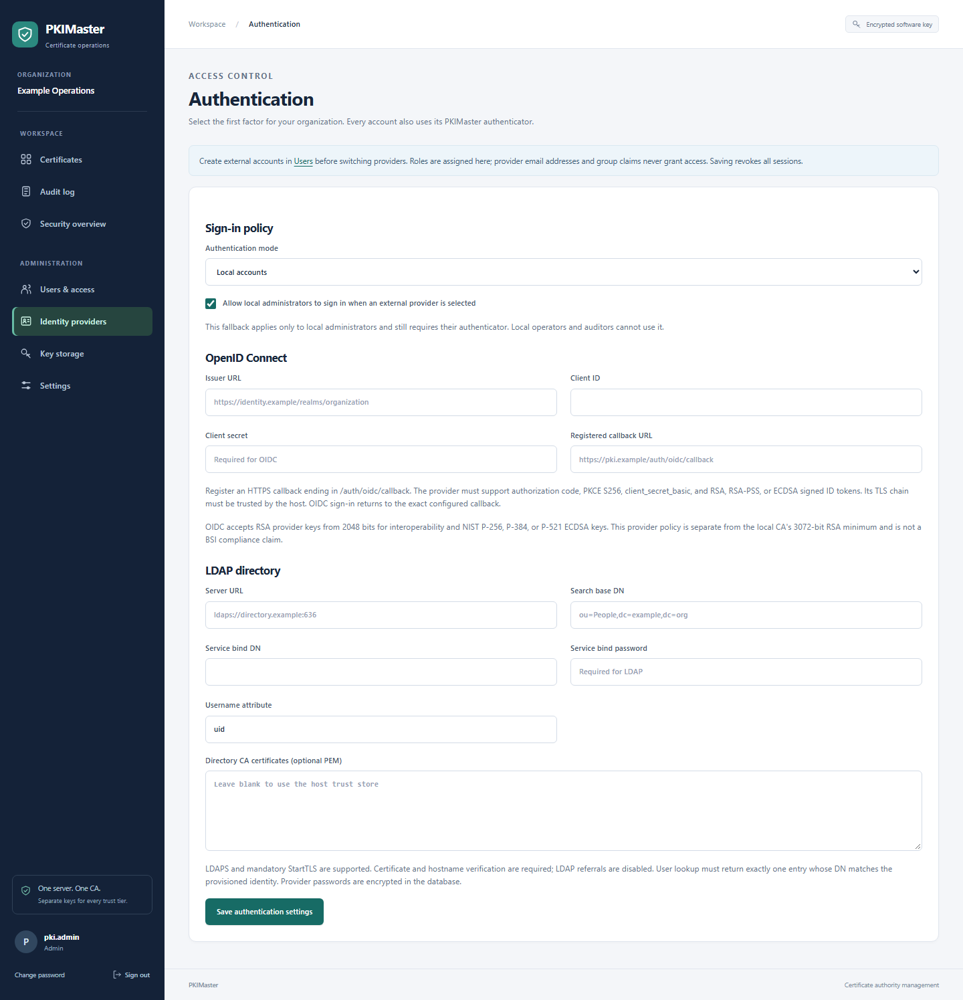
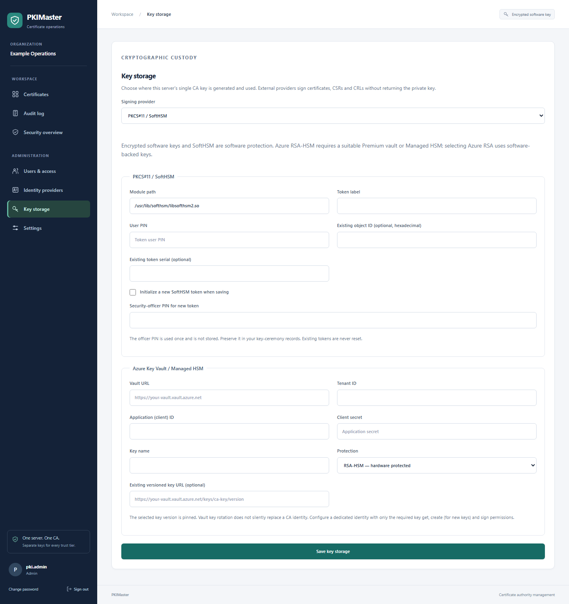
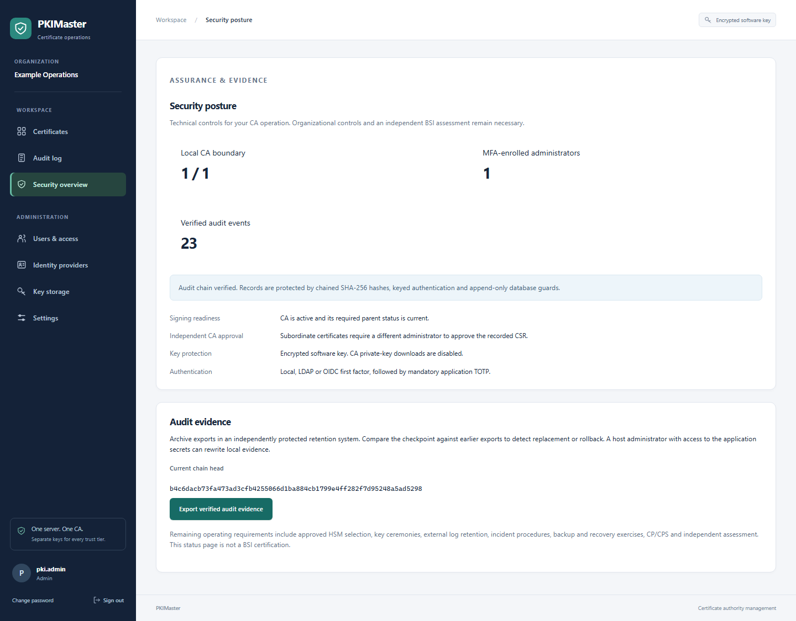

# PKIMaster

[](https://github.com/BartelLuis/PKIMaster/actions/workflows/ci.yml)
[](https://github.com/BartelLuis/PKIMaster/actions/workflows/security.yml)
[](https://github.com/BartelLuis/PKIMaster/actions/workflows/debian.yml)
[](#development-and-verification)
[](#install-with-apt)

**Private PKI for Debian, managed entirely through your browser.**

PKIMaster is a private PKI for Debian 13, installed as an APT package and configured through the browser. Each dedicated server runs exactly one Root, Intermediate, or Issuing CA. Separate CA servers exchange CSRs, signed certificates, public chains and CRLs; their private keys remain separate. Choose local, LDAP or OpenID Connect authentication with mandatory MFA, and encrypted software keys, PKCS#11/SoftHSM or Azure Key Vault for CA signing. Independent approval of subordinate CA requests, explicit roles and authenticated audit chains protect administration.

**BSI is the target operating baseline, not a certification claim.** See the [BSI readiness matrix and remaining gaps](docs/BSI-READINESS.md) before evaluating production use. Approved hardware selection, complete separation of trusted roles, protected external audit retention and operational certification remain deployment requirements.

## One CA per server



An optional Intermediate CA runs on another dedicated server. SQLite guards reject a second local CA, and startup refuses legacy databases containing multiple local CAs without deleting any data. Parent servers retain only the public certificates they issue for remote CAs. CA private keys cannot be exported through the web console.

Use the [browser workflow and migration instructions](docs/BSI-READINESS.md#browser-workflow) to establish the hierarchy. At least two administrator accounts on each signing parent are required: one submits the child CSR and another approves it. On the child, import the signed certificate, public parent chain and current signed parent CRLs; verify the root fingerprint through a trusted channel. Missing or stale parent CRLs block signing.

## Screenshots

Captured from the current web console on **2026-09-26**, using fictional demo data and one local Issuing CA. The Root runs separately; only its public chain and signed CRL are imported. The key-storage screenshot shows initial provider setup before a CA is created. Image filenames include a content fingerprint so updated captures use new URLs.



<details>
<summary>Certificate issuance</summary>

Issue certificates through the server's single CA, using certificate requests, certificate profiles and bounded validity.



</details>

<details>
<summary>Web-only configuration</summary>



</details>

<details>
<summary>Audit log</summary>



</details>

<details>
<summary>Identity providers, key storage and security posture</summary>







</details>

## Install with APT

Build the package on Debian 13 (the build runs the application tests):

```sh
sudo apt update
sudo apt install build-essential debhelper python3 python3-flask python3-cryptography python3-werkzeug gunicorn python3-jwt python3-ldap3 python3-requests python3-asn1crypto python3-pykcs11 softhsm2
sh scripts/build-deb.sh
sudo apt install ./dist/pkimaster_0.2.0-1_all.deb
```

The package installs a systemd service running as the dedicated `_pkimaster` system user. Python dependencies come from Debian; installation does not run pip or download Python packages. A signed public APT repository is not published by this project yet; `apt install ./…deb` resolves dependencies using your configured Debian repositories.

The service initially listens on **https://127.0.0.1:8443** and generates its own local HTTPS certificate. For a remote machine, connect through an SSH tunnel:

```sh
ssh -L 8443:127.0.0.1:8443 administrator@pki-server
```

Open **https://localhost:8443/setup** in your browser. The initial certificate is self-signed, so the browser will ask you to trust it. Use a local connection or an SSH connection to a server whose host key you have verified for initial setup.

Create the first administrator and organization through the setup page. There are no default credentials. Setup accepts only loopback connections and closes permanently after the first administrator is created. All users must enroll a SHA-256 TOTP authenticator (six digits, 30 seconds) before accessing the PKI. For later accounts, the creating administrator receives a short-lived setup key and must transfer it to the user over a separate protected channel; a password-authenticated browser cannot retrieve it. Store the enrollment key securely: automated MFA recovery is not yet available.

## Web-only configuration

Use **Settings** for organization, publication URL, certificate lifetime limits, CRL lifetime, session timeout, private-key export policy, listen address, HTTPS port, and HTTPS certificate/key upload. New installations need no environment variables, editable configuration files, or configuration CLI.

Use **Authentication** to select local accounts, LDAP (LDAPS or mandatory StartTLS) or OIDC (authorization code flow with PKCE). Administrators provision external users with their exact LDAP DN or OIDC issuer and subject; provider claims cannot create accounts or grant roles. Every provider still requires application TOTP. A separately enabled local administrator sign-in supports recovery from a provider outage. Changing authentication revokes existing sessions. See [identity and key-provider setup](docs/PROVIDERS.md).

Use **Key storage** before initializing the CA to choose encrypted software keys, PKCS#11/SoftHSM or Azure Key Vault. SoftHSM tokens can be initialized through the browser. Azure supports software-backed RSA and hardware-backed RSA-HSM, with an exact key version and public-key fingerprint pinned to the CA. Credentials are encrypted and can be replaced after proving access to the same key. The provider cannot be changed for an existing CA, and a provider outage never falls back to a software key.

The listener initially binds to loopback. To enable remote access, upload a trusted server certificate and matching unencrypted PEM key, then choose the server's IP address or `0.0.0.0`/`::` and an unprivileged port (1024–65535). The packaged service applies listener and TLS changes automatically within a few seconds; reconnect at the saved address and port. Firewall and DNS administration remain part of the host/network deployment.

Set the public base URL before issuing certificates if relying parties should discover the CRL endpoint automatically. Newly issued subordinate and end-entity certificates include the corresponding CRL distribution point. Changing the URL does not rewrite certificates already issued. The publication path is `/crl/<authority-id>.crl` and is accessible without login; the rest of the inventory requires authentication.

## Certificate management

- One local Root, Intermediate, or Issuing CA per dedicated server, with CSR-based external signing and enforced path-length constraints.
- TLS server, TLS client, or combined certificate profiles; DNS and IP SANs, including validated IDNA names.
- Sign an existing PEM CSR to keep its private key outside the service, or generate an RSA4096 key. CSR signatures and key strength are checked, and arbitrary requested extensions are not copied.
- Issued validity never exceeds issuer validity or the configured leaf lifetime limit. Expired, revoked, or not-yet-valid ancestors block issuance.
- Certificate and subordinate CA revocation with reasons, signed DER CRLs, monotonically increasing CRL numbers, and cache invalidation on revocation.
- Disabling the local CA stops its signing. Revoke a subordinate on its parent server and distribute the new CRL. Remove a distrusted root from relying-party trust stores. Disconnected servers learn parent revocation only when updated CRLs are imported.
- Certificate and chain downloads, searchable paginated inventory, and expiry counts. Generated end-entity key exports are disabled by default, restricted to administrators when enabled, and audited. CA key exports are always forbidden.

Revocation is permanent in this version, including the `certificate_hold` reason. Relying parties must be configured to check CRLs; publication alone does not make clients enforce revocation. CRLs are refreshed on request and cannot be signed by expired CAs.

## Administration and security

| Role | Permissions |
| --- | --- |
| Administrator | Manage CAs, issue/revoke certificates, manage users and settings, view audit history, export end-entity keys when policy allows |
| Operator | Issue/revoke end-entity certificates and view inventory/audit history |
| Auditor | View inventory, public certificate/chain downloads, and audit history |

Administrators create and deactivate accounts and reset local passwords in **Users**. Local users can change their own password; external passwords remain managed by the identity provider. Deactivation and password changes invalidate existing sessions; the last enabled administrator able to use the selected authentication mode cannot be deactivated. Sessions use secure cookies in the packaged service, all forms require CSRF protection, and password and TOTP failures are throttled in shared persistent storage. Successful TOTP codes cannot be replayed; password reset retains MFA.

CA and generated certificate keys are encrypted at rest using an installation-specific secret. Session and encryption secrets are generated separately, stored with private file permissions, and preserved across restarts and package upgrades. Startup fails if an existing database's encryption secret is missing or incompatible. The independent HTTPS server identity is stored in a private PEM file so the service can start unattended.

Audit records cover setup, authentication, users, policy changes, issuance, revocation, CRL publication, and private-key exports. Records form a SHA-256 chain authenticated with HMAC and protected by append-only database guards. Startup and mutations verify integrity; **Security posture** exports verified evidence and checkpoints for independent retention. Older records are sealed at migration, which cannot establish their earlier integrity. The local store is **not tamper-proof against a host administrator with application secrets**; retain checkpoints off-host to detect rollback.

## Operations and backups

```sh
sudo systemctl status pkimaster
sudo journalctl -u pkimaster
```

State lives in `/var/lib/pkimaster`, including the SQLite database, `runtime-secrets.json`, `server-tls/` and optional `softhsm/` tokens. Back up the complete directory together; the database alone cannot recover encrypted keys, provider credentials or MFA secrets. External HSM/Azure keys require the provider's separate backup, retention and recovery procedures. Stop the service for a consistent file-level backup and protect backups as CA key material:

```sh
sudo systemctl stop pkimaster
sudo sh -c 'umask 077; tar -C /var/lib -czf /root/pkimaster-backup.tar.gz pkimaster'
sudo systemctl start pkimaster
```

Restore the complete directory with ownership `_pkimaster:_pkimaster`, directory mode `0700`, and private file modes before starting the service. Package removal and purge deliberately retain the state directory and its system user to avoid destroying CA keys.

Existing **single-CA** source installations can be upgraded in place using their original database and encryption secret. Multi-CA installations are blocked and require a reviewed migration before upgrading; see [migration boundaries](docs/BSI-READINESS.md#existing-installations-and-migration). The first upgraded startup imports legacy secrets from the original environment or development secret files and persists them; it never silently replaces encryption secrets. Schema changes are additive. Moving an existing installation into the Debian service is an explicit migration: stop the old service, back up and migrate its complete state into `/var/lib/pkimaster`, and restore ownership before enabling the packaged service. Do not generate a new encryption secret for existing CA data.

## Development and verification

```sh
python3 -m venv .venv
. .venv/bin/activate
pip install -e .
pkimaster-dev
python -m unittest discover -s tests -v
```

Development serves HTTP only on `127.0.0.1:8000`, with its own local `instance/` state. Use the packaged HTTPS service for deployment.

`scripts/smoke-deb.sh` exercises package installation, HTTPS startup, reinstall, removal, and purge on a **disposable Debian 13 machine**. It refuses to run against an existing PKIMaster installation or state directory. CI builds the `.deb`, runs the tests, and performs this smoke check.

## GitHub automation

The workflows under `.github/workflows/` provide these checks on pull requests and pushes to `main`, with manual runs available in the Actions tab:

| Workflow | Checks and artifacts |
| --- | --- |
| Python CI | Tests on Python 3.11–3.14 on Linux and Python 3.14 on Windows, coverage reports, Python correctness checks, workflow/Dependabot schema validation, actionlint, ShellCheck, wheel/source builds, and installation outside the checkout |
| Security | CodeQL analysis of Python and GitHub Actions, plus separate strict vulnerability audits of application and CI dependencies |
| Debian package | Debian 13 build and complete test suite, package metadata/file/permission checks, HTTPS installation and upgrade smoke tests, `.deb`/build metadata/checksums, and diagnostic logs |

Python CI and Security also run weekly. Actions are pinned to full commit SHAs, checkout credentials are not persisted, and token permissions are limited per workflow/job. Checks run on ordinary pull requests, including Dependabot and fork pull requests, without requiring project secrets. The workflows build artifacts; they do not publish releases or deploy the service.

`.github/dependabot.yml` checks GitHub Actions every Monday at 06:00 and Python dependencies at 06:30, Europe/Berlin time. It covers `pyproject.toml` and the pinned tools in `requirements-ci.txt`, groups compatible minor/patch updates, and keeps major version updates separate. Security updates have their own Python group. Debian's Python packages continue to receive updates through APT rather than Dependabot.

To activate these checks, merge the workflow and Dependabot files into the default branch and ensure Actions is enabled. Use CodeQL advanced setup for `security.yml`; disable an existing CodeQL default setup first. Public repositories can use CodeQL, while private repositories require the appropriate GitHub Code Security entitlement. Enable Dependabot alerts and security updates in repository settings to receive alert-driven fixes as well as scheduled version updates. See [GitHub's Dependabot configuration reference](https://docs.github.com/en/code-security/reference/supply-chain-security/dependabot-options-reference) and [CodeQL setup documentation](https://docs.github.com/en/code-security/code-scanning/enabling-code-scanning/configuring-advanced-setup-for-code-scanning).

Install local CI tooling with `python -m pip install -r requirements-ci.txt`. The package maintainer contact in both Python and Debian metadata is `maintainers@pkimaster.de`.

## Current scope

This is a developing private PKI with separate CA hosts. It is not BSI-certified or a complete implementation of TR-03145. [The readiness matrix](docs/BSI-READINESS.md) records implemented controls and blocking gaps, including HSM integration, comprehensive dual control, protected external audit retention, operational governance, recovery and independent assessment. SSO, ACME/SCEP/EST, OCSP, automated parent CRL synchronization, CA rollover and high availability are also not implemented.
