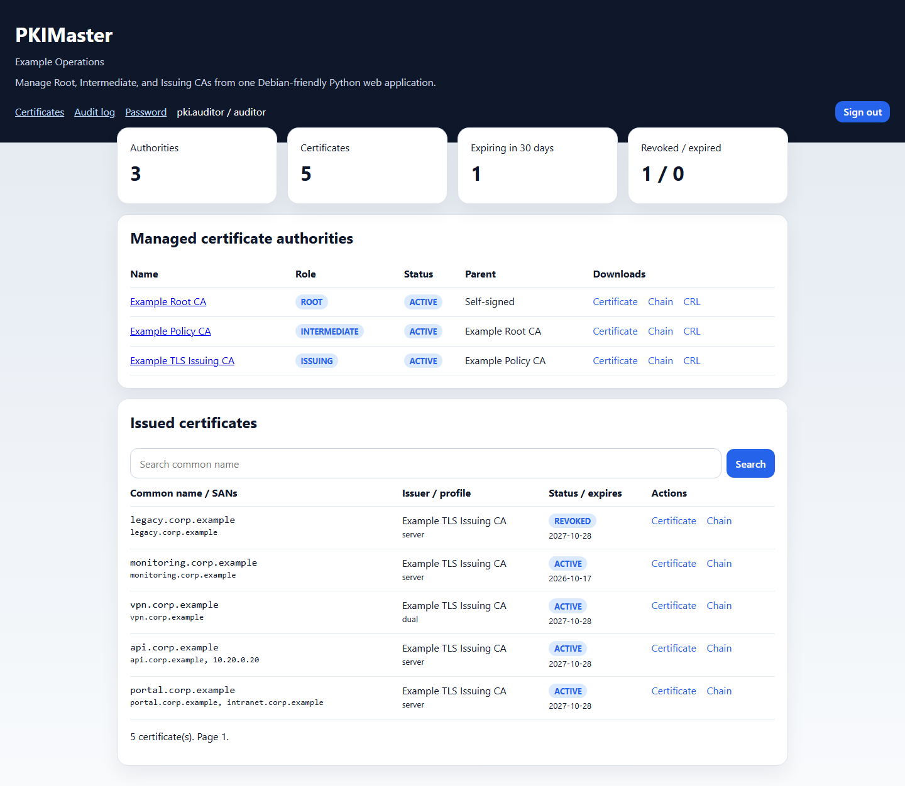
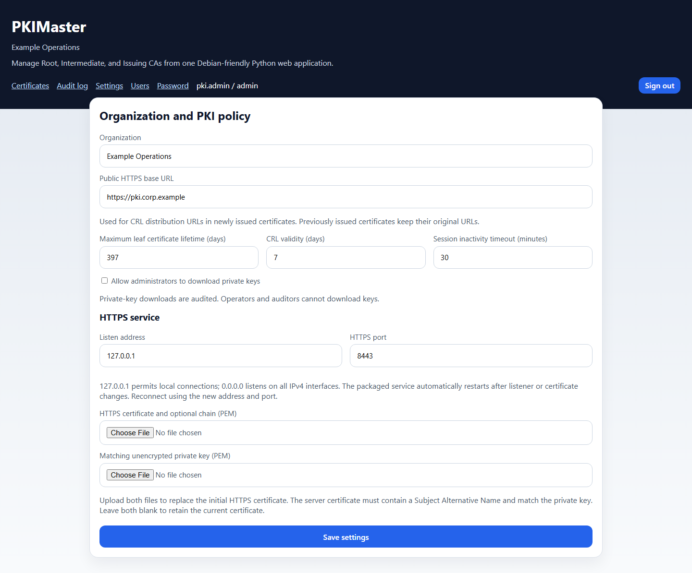
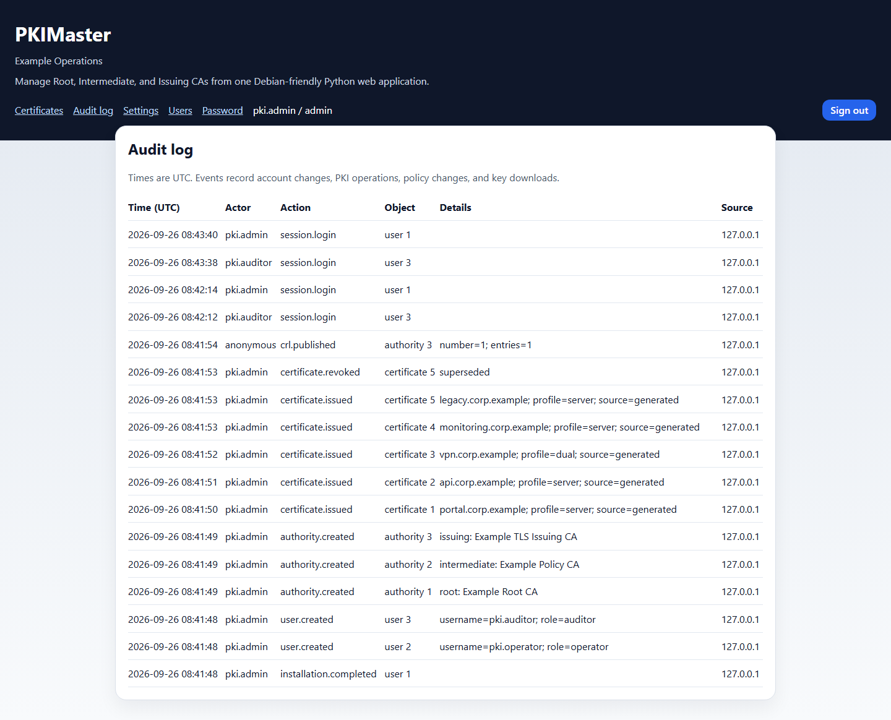

# PKIMaster

[](https://github.com/BartelLuis/PKIMaster/actions/workflows/ci.yml)
[](https://github.com/BartelLuis/PKIMaster/actions/workflows/security.yml)
[](https://github.com/BartelLuis/PKIMaster/actions/workflows/debian.yml)
[](#development-and-verification)
[](#install-with-apt)

**Private PKI for Debian, managed entirely through your browser.**

PKIMaster is a self-hosted private PKI (public key infrastructure) platform for Debian 13, delivered as an APT package with web-only setup and configuration. Manage Root, Intermediate, and Issuing certificate authorities, sign certificate requests, issue and revoke certificates, and publish signed certificate revocation lists from one console. User roles, encrypted private-key storage, and audit logging support controlled administration of your organization's internal certificates.

## Screenshots

These screenshots show the web console running with local demo data for a fictional organization.

**Certificate inventory** — The auditor view shows the CA hierarchy, issued certificates, revocation status, and upcoming expirations.



<details>
<summary>CA creation and certificate issuance</summary>

Create certificate authorities and issue certificates with a selected profile, DNS/IP subject alternative names, and a policy-limited validity period. Existing certificate requests can also be signed through the web form.


</details>

<details>
<summary>Web-only configuration</summary>

Manage organization settings, certificate and CRL lifetimes, session timeout, private-key export policy, and the HTTPS listener from the browser.



</details>

<details>
<summary>Audit log</summary>

Review account activity, CA creation, certificate issuance and revocation, and CRL publication with timestamps and actor information.



</details>

## Install with APT

Build the package on Debian 13 (the build runs the application tests):

```sh
sudo apt update
sudo apt install build-essential debhelper python3 python3-flask python3-cryptography python3-werkzeug gunicorn
sh scripts/build-deb.sh
sudo apt install ./dist/pkimaster_0.2.0-1_all.deb
```

The package installs a systemd service running as the dedicated `_pkimaster` system user. Python dependencies come from Debian; installation does not run pip or download Python packages. A signed public APT repository is not published by this project yet; `apt install ./…deb` resolves dependencies using your configured Debian repositories.

The service initially listens on **https://127.0.0.1:8443** and generates its own local HTTPS certificate. For a remote machine, connect through an SSH tunnel:

```sh
ssh -L 8443:127.0.0.1:8443 administrator@pki-server
```

Open **https://localhost:8443/setup** in your browser. The initial certificate is self-signed, so the browser will ask you to trust it. Use a local connection or an SSH connection to a server whose host key you have verified for initial setup.

Create the first administrator and organization through the setup page. There are no default credentials. Setup accepts only loopback connections and closes permanently after the first administrator is created.

## Web-only configuration

Use **Settings** for organization, publication URL, certificate lifetime limits, CRL lifetime, session timeout, private-key export policy, listen address, HTTPS port, and HTTPS certificate/key upload. New installations need no environment variables, editable configuration files, or configuration CLI.

The listener initially binds to loopback. To enable remote access, upload a trusted server certificate and matching unencrypted PEM key, then choose the server's IP address or `0.0.0.0`/`::` and an unprivileged port (1024–65535). The packaged service applies listener and TLS changes automatically within a few seconds; reconnect at the saved address and port. Firewall and DNS administration remain part of the host/network deployment.

Set the public base URL before issuing certificates if relying parties should discover the CRL endpoint automatically. Newly issued subordinate and end-entity certificates include the corresponding CRL distribution point. Changing the URL does not rewrite certificates already issued. The publication path is `/crl/<authority-id>.crl` and is accessible without login; the rest of the inventory requires authentication.

## Certificate management

- Root, Intermediate, and Issuing CAs with enforced hierarchy and path-length constraints.
- TLS server, TLS client, or combined certificate profiles; DNS and IP SANs, including validated IDNA names.
- Sign an existing PEM CSR to keep its private key outside the service, or generate an RSA4096 key. CSR signatures and key strength are checked, and arbitrary requested extensions are not copied.
- Issued validity never exceeds issuer validity or the configured leaf lifetime limit. Expired, revoked, or not-yet-valid ancestors block issuance.
- Certificate and subordinate CA revocation with reasons, signed DER CRLs, monotonically increasing CRL numbers, and cache invalidation on revocation.
- Disabling a root stops issuance in its subtree. Administrators must also remove that root from relying-party trust stores to withdraw external trust.
- Certificate and chain downloads, searchable paginated inventory, and expiry counts. Private-key exports are disabled by default, restricted to administrators when enabled, and audited.

Revocation is permanent in this version, including the `certificate_hold` reason. Relying parties must be configured to check CRLs; publication alone does not make clients enforce revocation. CRLs are refreshed on request and cannot be signed by expired CAs.

## Administration and security

| Role | Permissions |
| --- | --- |
| Administrator | Manage CAs, issue/revoke certificates, manage users and settings, view audit history, export keys when policy allows |
| Operator | Issue/revoke end-entity certificates and view inventory/audit history |
| Auditor | View inventory, public certificate/chain downloads, and audit history |

Administrators create and deactivate accounts and reset passwords in **Users**. All users can change their own password. Deactivation and password changes invalidate existing sessions; the last enabled administrator cannot be deactivated. Sessions use secure cookies in the packaged service, all mutations require CSRF protection, and login failures are throttled in shared persistent storage.

CA and generated certificate keys are encrypted at rest using an installation-specific secret. Session and encryption secrets are generated separately, stored with private file permissions, and preserved across restarts and package upgrades. Startup fails if an existing database's encryption secret is missing or incompatible. The independent HTTPS server identity is stored in a private PEM file so the service can start unattended.

Audit records cover setup, authentication, users, policy changes, issuance, revocation, CRL publication, and private-key exports. The web UI provides no audit modification/deletion operation. The SQLite audit store is **not tamper-proof against the host administrator**.

## Operations and backups

```sh
sudo systemctl status pkimaster
sudo journalctl -u pkimaster
```

State lives in `/var/lib/pkimaster`, including the SQLite database, `runtime-secrets.json`, and `server-tls/`. Back up the complete directory together; the database alone cannot recover encrypted CA keys. Stop the service for a consistent file-level backup and protect backups as CA key material:

```sh
sudo systemctl stop pkimaster
sudo sh -c 'umask 077; tar -C /var/lib -czf /root/pkimaster-backup.tar.gz pkimaster'
sudo systemctl start pkimaster
```

Restore the complete directory with ownership `_pkimaster:_pkimaster`, directory mode `0700`, and private file modes before starting the service. Package removal and purge deliberately retain the state directory and its system user to avoid destroying CA keys.

Existing source installations are upgraded in place by starting the new code against their existing database and original encryption secret. The first upgraded startup imports legacy secrets from the original environment or development secret files and persists them; it never silently replaces encryption secrets. Schema changes are additive. Moving an existing installation into the Debian service is an explicit migration: stop the old service, back up and migrate its complete state into `/var/lib/pkimaster`, and restore ownership before enabling the packaged service. Do not generate a new encryption secret for existing CA data.

## Development and verification

```sh
python3 -m venv .venv
. .venv/bin/activate
pip install -e .
pkimaster-dev
python -m unittest discover -s tests -v
```

Development serves HTTP only on `127.0.0.1:8000`, with its own local `instance/` state. Use the packaged HTTPS service for deployment.

`scripts/smoke-deb.sh` exercises package installation, HTTPS startup, reinstall, removal, and purge on a **disposable Debian 13 machine**. It refuses to run against an existing PKIMaster installation or state directory. CI builds the `.deb`, runs the tests, and performs this smoke check.

## GitHub automation

The workflows under `.github/workflows/` provide these checks on pull requests and pushes to `main`, with manual runs available in the Actions tab:

| Workflow | Checks and artifacts |
| --- | --- |
| Python CI | Tests on Python 3.11–3.14 on Linux and Python 3.14 on Windows, coverage reports, Python correctness checks, workflow/Dependabot schema validation, actionlint, ShellCheck, wheel/source builds, and installation outside the checkout |
| Security | CodeQL analysis of Python and GitHub Actions, plus separate strict vulnerability audits of application and CI dependencies |
| Debian package | Debian 13 build and complete test suite, package metadata/file/permission checks, HTTPS installation and upgrade smoke tests, `.deb`/build metadata/checksums, and diagnostic logs |

Python CI and Security also run weekly. Actions are pinned to full commit SHAs, checkout credentials are not persisted, and token permissions are limited per workflow/job. Checks run on ordinary pull requests, including Dependabot and fork pull requests, without requiring project secrets. The workflows build artifacts; they do not publish releases or deploy the service.

`.github/dependabot.yml` checks GitHub Actions every Monday at 06:00 and Python dependencies at 06:30, Europe/Berlin time. It covers `pyproject.toml` and the pinned tools in `requirements-ci.txt`, groups compatible minor/patch updates, and keeps major version updates separate. Security updates have their own Python group. Debian's Python packages continue to receive updates through APT rather than Dependabot.

To activate these checks, merge the workflow and Dependabot files into the default branch and ensure Actions is enabled. Use CodeQL advanced setup for `security.yml`; disable an existing CodeQL default setup first. Public repositories can use CodeQL, while private repositories require the appropriate GitHub Code Security entitlement. Enable Dependabot alerts and security updates in repository settings to receive alert-driven fixes as well as scheduled version updates. See [GitHub's Dependabot configuration reference](https://docs.github.com/en/code-security/reference/supply-chain-security/dependabot-options-reference) and [CodeQL setup documentation](https://docs.github.com/en/code-security/code-scanning/enabling-code-scanning/configuring-advanced-setup-for-code-scanning).

Install local CI tooling with `python -m pip install -r requirements-ci.txt`. The package maintainer contact in both Python and Debian metadata is `maintainers@pkimaster.de`.

## Current scope

This is a single-host private-PKI implementation with enterprise administration foundations. HSM/PKCS#11 integration, offline-root ceremonies, approval workflows, MFA/SSO, ACME/SCEP/EST enrollment, OCSP, automatic renewal, high availability, and external tamper-evident audit retention are not implemented. Those capabilities and a dedicated security review are needed before claiming a complete enterprise PKI platform.
