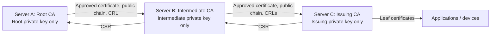

# BSI readiness and deployment boundary

PKIMaster is under development. **It is not BSI-certified, and this implementation does not yet meet all requirements for a BSI-assessed CA operation.** Passing application tests is not an operational conformity assessment. Do not describe this release as a complete enterprise PKI or as BSI-compliant.

The working reference for the requested BSI scope is [BSI TR-03145, Secure Certification Authority Operation](https://www.bsi.bund.de/EN/Themen/Unternehmen-und-Organisationen/Standards-und-Zertifizierung/Technische-Richtlinien/TR-nach-Thema-sortiert/tr03145/tr-03145.html), particularly the generic requirements in [Part 1, version 1.1](https://www.bsi.bund.de/SharedDocs/Downloads/EN/BSI/Publications/TechGuidelines/TR03145/TR03145.pdf?__blob=publicationFile&v=1). An assessment must define the actual operating environment, applicable profile, protection requirements, certificate policy and certification practice statement. Organizational measures and independent audit evidence are outside what a software update can establish.

## Deployment architecture

**One dedicated server or VM runs one PKIMaster CA.** Install one APT service using `/var/lib/pkimaster` on each server. A Root, an optional Intermediate, and each Issuing CA have separate hosts, state directories, identities and keys. Do not colocate multiple installations or containers on one server. The application enforces one local CA in its database; it cannot police an operating-system administrator starting a separate installation elsewhere on the host.

The Root can also sign an Issuing CA directly. A parent holds its issued subordinate **public certificates**, never the subordinate keys. Downloading any CA private key is forbidden even when end-entity key export is enabled. This software restriction does not provide HSM protection: the software CA key and its decryption secret are available to the service and ultimately the host administrator.

## Implemented controls and evidence

This is a development mapping, not a clause-by-clause attestation. The control descriptions below refer to this repository's implementation; the referenced BSI document defines the broader assessment scope.

| Area | Implemented behavior | Evidence / remaining boundary |
| --- | --- | --- |
| CA separation (project requirement) | SQLite constraints and transactions prevent creating a second local CA, including concurrently. CA identity cannot be deleted or replaced through the application. | `tests/test_app.py`; physical host separation remains a deployment responsibility. |
| CA key ownership | Subordinates generate a local RSA4096 key and CSR. Only the signed certificate and public parent chain return to the subordinate. | `tests/test_ca_exchange.py`, `tests/test_distributed_ca.py`; HSM integration remains missing. |
| Authentication and roles | All accounts require password plus TOTP. Secrets are encrypted, successful counters are consumed transactionally, attempts are persistently throttled, and password reset does not remove MFA. Password-only and pre-MFA legacy sessions cannot enter the PKI. | `tests/test_mfa.py`, `tests/test_enterprise.py`; no phishing-resistant authentication or automated MFA recovery. |
| Independent CA approval | A subordinate CSR is recorded immutably; a different administrator account must approve before the signature is produced. Self-approval and repeated approval are rejected. | `tests/test_distributed_ca.py`; distinct human identity and personnel vetting require operating procedures. Root creation, activation, settings, revocation and leaf issuance do not yet require dual approval. |
| Certificate activation | CSR/key/subject match, CA capabilities, chain signatures, validity and path lengths are checked. The importing administrator supplies the root SHA-256 fingerprint from a trusted channel. | `tests/test_ca_exchange.py`, `tests/test_distributed_ca.py`; external authorization and root fingerprint distribution are operational responsibilities. Unsupported chain constraints are rejected. |
| Parent revocation | A subordinate cannot issue while any imported parent CRL is absent, stale, invalid or shows revocation. CRL rollback is rejected; an observed revocation disables the local CA permanently. | `tests/test_distributed_ca.py`; CRLs are manually imported in the browser. Parent revocation becomes known on import, not immediately across disconnected hosts. |
| Signing policy | New local CA keys are RSA4096. CA exchange and web leaf CSR issuance require RSA3072+ or supported P-256/P-384/P-521 keys and supported SHA-2 signatures. Issuance is capped by parent validity and leaf policy. | Crypto tests; legacy material, the HTTPS identity, algorithm lifetimes, approved cryptographic implementations and post-quantum transition still need a deployment-specific review. This is not blanket TR-02102 conformity. |
| Audit and service isolation | Authentication, CA requests/decisions, activation, issuance, revocation, status imports and settings are recorded. APT installs one unprivileged, hardened systemd service with private state permissions. | Enterprise tests and Debian package smoke checks; local SQLite logs are writable by a compromised service/host administrator. |

TR-03145-1 section 6.7 addresses role management and separation of responsibilities; sections 6.5–6.6 concern cryptography and key handling. The software controls above only cover part of those operational areas. Crypto design and deployment must also be assessed against the applicable edition and lifetime guidance of [BSI TR-02102](https://www.bsi.bund.de/DE/Themen/Unternehmen-und-Organisationen/Standards-und-Zertifizierung/Technische-Richtlinien/TR-nach-Thema-sortiert/tr02102/tr02102_node.html).

## Blocking gaps before a BSI production claim

1. **Protected key operations:** integrate and test an appropriate HSM/PKCS#11 provider; define approved modules, key ceremonies, dual control, backup and destruction. There is currently no HSM provider.
2. **Complete trusted-role model:** separate system/security administration, certificate approval and audit responsibilities, including controlled privilege changes. Extend independent approval to all operations the selected policy classifies as critical.
3. **Audit retention and monitoring:** external protected retention, trustworthy timestamps, monitoring, incident alerts, review procedures and evidence that logs cannot be silently altered or truncated.
4. **Operational governance:** establish an ISMS, CP/CPS, registration/identity validation, personnel controls, secure facilities, incident/compromise and termination procedures, and documented responsibilities. The project has no evidence establishing those controls.
5. **Recovery and lifecycle:** tested backup/restore ceremonies, MFA recovery, CA renewal/rollover and decommissioning, availability objectives and external status-publication infrastructure. One local CA identity is deliberately permanent in this version; rollover is not implemented.
6. **Cryptographic assessment:** review the complete crypto stack, TLS configuration, algorithm/key validity horizons, randomness, legacy keys and post-quantum transition against the selected current BSI guidelines. A larger RSA key alone is insufficient.
7. **Independent verification:** threat model, security review, penetration testing and an appropriate conformity assessment of the deployed CA operation. No such certification is asserted here.

## Browser workflow

1. Install the APT package on each dedicated server. Complete loopback HTTPS setup, then enroll the mandatory authenticator (SHA-256, six digits, 30 seconds). Preserve the enrollment key in a protected recovery procedure; automated recovery is not implemented.
2. Initialize the Root on its host. Create at least two separately assigned administrator accounts for subordinate signing. Keep the root offline between approved ceremonies where the deployment policy requires it; arrange separate public certificate/CRL distribution.
3. Initialize an Intermediate or Issuing CA on its own host. Download its CSR. Submit it to the parent's **Request subordinate CA signing** form.
4. A second administrator reviews the recorded role, validity, subject and CSR fingerprint and approves the exact request. Download the resulting certificate and **Parent chain**.
5. On the child server, import the certificate and parent chain, supplying the independently verified root SHA-256 fingerprint. Then import the signed parent CRLs in PEM format, immediate issuer first and root last. Parent consoles offer both DER and PEM downloads.
6. Repeat for another trust tier if needed. Refresh every parent CRL before expiry. A revocation on a parent must be distributed to affected child servers and relying parties. Do not rely on a disconnected child automatically learning that it was revoked.

## Existing installations and migration

An existing database with more than one local CA is refused at startup. This check **does not delete keys, certificates or audit records**, and does not choose a CA to keep. There is no automatic multi-CA migration in this version.

Before upgrading an existing deployment, inventory its CAs and take a consistent protected backup of the entire state directory with the old service stopped. Retain the original database, encryption secrets, HTTPS identity, audit records and a verified copy of the previous package. Do not delete CA rows, drop database guards, copy a live SQLite file or generate replacement encryption secrets as a workaround.

A multi-CA deployment needs a reviewed migration and trust-transition plan, separate hosts and a tested recovery procedure before this version is activated. The existing CA key export route is intentionally unavailable; use the retained previous deployment and controlled key-custody procedures when designing migration. Existing single-CA deployments preserve their stored key and certificate; each user must complete MFA enrollment at their next authenticated session. Restoring a backup onto a recovery host requires fencing/stopping the previous host so two active instances never use the same CA identity.
