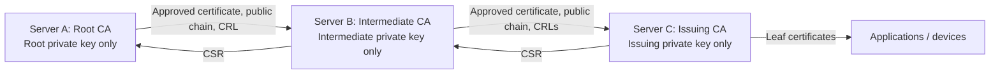

# BSI readiness and deployment boundary

PKIMaster is under development. **It is not BSI-certified, and this implementation does not yet meet all requirements for a BSI-assessed CA operation.** Passing application tests is not an operational conformity assessment. Do not describe this release as a complete enterprise PKI or as BSI-compliant.

The working reference for the requested BSI scope is [BSI TR-03145, Secure Certification Authority Operation](https://www.bsi.bund.de/EN/Themen/Unternehmen-und-Organisationen/Standards-und-Zertifizierung/Technische-Richtlinien/TR-nach-Thema-sortiert/tr03145/tr-03145.html), particularly the generic requirements in [Part 1, version 1.1](https://www.bsi.bund.de/SharedDocs/Downloads/EN/BSI/Publications/TechGuidelines/TR03145/TR03145.pdf?__blob=publicationFile&v=1). An assessment must define the actual operating environment, applicable profile, protection requirements, certificate policy and certification practice statement. Organizational measures and independent audit evidence are outside what a software update can establish.

## Deployment architecture

**One dedicated server or VM runs one current PKIMaster CA.** Install one APT service using `/var/lib/pkimaster` on each server. A Root, an optional Intermediate, and each Issuing CA have separate hosts, state directories, identities and keys. Do not colocate multiple installations or containers on one server. The application enforces one non-revoked local CA in its database and retains revoked CAs as history; it cannot police an operating-system administrator starting a separate installation elsewhere on the host.

The Root can also sign an Issuing CA directly. A parent holds its issued subordinate **public certificates**, never the subordinate keys. Downloading any CA private key is forbidden even when end-entity key export is enabled. Optional PKCS#11 and Azure providers keep private-key signing in the selected provider. SoftHSM and encrypted local keys remain software protection; Azure RSA-HSM and physical PKCS#11 devices require separate hardware qualification and operational assessment.

## Implemented controls and evidence

This is a development mapping, not a clause-by-clause attestation. The control descriptions below refer to this repository's implementation; the referenced BSI document defines the broader assessment scope.

| Area | Implemented behavior | Evidence / remaining boundary |
| --- | --- | --- |
| CA separation (project requirement) | SQLite constraints and transactions prevent creating a second non-revoked local CA, including concurrently. After revocation, a new CA can be initialized while previous identities, certificates and history remain archived. Revoked identities cannot be reactivated. An administrator may explicitly delete a revoked CA and its associated local material after confirming its exact name; audit records remain. | `tests/test_app.py`, `tests/test_ca_reinitialization.py`, `tests/test_ca_deletion.py`; physical host separation and retention/destruction procedures remain deployment responsibilities. |
| CA key ownership | Subordinates generate a dedicated RSA4096 key and CSR in the selected software/PKCS#11/Azure provider. Only the signed certificate and public parent chain return to the subordinate. Provider version/object and public-key fingerprint are pinned; external signatures are locally verified. | `tests/test_ca_exchange.py`, `tests/test_distributed_ca.py`, `tests/test_key_backends.py`, `tests/test_key_storage.py`; approved physical protection and key ceremonies remain operational responsibilities. |
| Authentication and roles | All accounts require a verified local/LDAP/OIDC first factor plus application TOTP. Encrypted factor secrets, atomic counter consumption and persistent throttles protect sign-in. Hashed one-use recovery codes permit browser-bound factor replacement after first-factor verification; replacement invalidates other sessions and previous recovery codes. | `tests/test_mfa.py`, `tests/test_mfa_recovery.py`, `tests/test_enterprise.py`, `tests/test_identity.py`; no phishing-resistant application factor. Recovery-code custody and external identity recovery require operating procedures. |
| Independent CA approval | A subordinate CSR is recorded immutably; a different administrator account must approve before the signature is produced. Self-approval and repeated approval are rejected. | `tests/test_distributed_ca.py`; distinct human identity and personnel vetting require operating procedures. Root creation, activation, settings, revocation, CA deletion and leaf issuance do not yet require dual approval. |
| Certificate activation | CSR/key/subject match, CA capabilities, chain signatures and validity are checked. Path-length limits in imported parent certificates are checked against the actual CA chain. The importing administrator supplies the root SHA-256 fingerprint from a trusted channel. | `tests/test_ca_exchange.py`, `tests/test_distributed_ca.py`; external authorization and root fingerprint distribution are operational responsibilities. Unsupported chain constraints are rejected. |
| Parent revocation | A subordinate cannot issue while any imported parent CRL is absent, stale, invalid or shows revocation. CRL rollback is rejected; an observed revocation disables the local CA permanently. | `tests/test_distributed_ca.py`; CRLs are manually imported in the browser. Parent revocation becomes known on import, not immediately across disconnected hosts. |
| Public status distribution | Web-managed public CDP/AIA URLs, pinned SFTP upload, encrypted credentials, durable queues, atomic publication and background CRL renewal. Independent HTTP(S) monitoring verifies public CRL reachability, signatures, freshness and known revocations; expiry findings support email/webhook notifications and recovery notices. | Publication and `tests/test_monitoring*.py` suites; external monitoring of this host, redundant distribution, SSH policy approval, offline-Root ceremonies and client revocation enforcement remain operational responsibilities. |
| Backup and leaf renewal | Passphrase-encrypted consistent state snapshots, validated fresh-host restore, preserved CA identity and invalidated sessions. Leaf renewal supports new CSRs and linked predecessor/successor records while leaving the predecessor unchanged. | `tests/test_backup.py`, `tests/test_renewal.py`; rehearse recovery, retain passphrases separately, fence the source, preserve external provider keys and prevent obsolete-snapshot rollback. CA rollover is separate from leaf renewal. |
| Signing policy | New CA keys are RSA4096; new RSA certificate, CSR and CRL signatures use SHA-256 RSA-PSS with a digest-sized salt. CA exchange and web leaf CSR issuance require RSA3072+ or supported P-256/P-384/P-521 keys and SHA-2 signatures. Issuance is capped by parent validity and leaf policy. | Crypto and provider tests; legacy material, the HTTPS identity, algorithm lifetimes, approved cryptographic implementations and post-quantum transition still need a deployment-specific review. This is not blanket TR-02102 conformity. |
| External authentication | Optional LDAPS/mandatory StartTLS and OIDC authorization-code/PKCE, with explicit pre-provisioned identities and mandatory application TOTP. No role or account creation from provider claims. Authentication changes revoke existing sessions. | `tests/test_identity.py`; provider availability, trusted TLS roots, identity lifecycle and operating procedures require deployment validation. |
| Audit and service isolation | Authentication, CA decisions and lifecycle, settings and key-provider changes form a SHA-256 chain authenticated with HMAC, with append-only database guards. Startup and mutations verify integrity; Security posture exports checkpoints and records. APT runs an unprivileged, hardened service. | `tests/test_audit_integrity.py`, `tests/test_key_storage.py`, enterprise and Debian checks. Existing records are sealed at migration, not retrospectively authenticated. A compromised host with application secrets can rewrite evidence; off-host retention is required. |

TR-03145-1 section 6.7 addresses role management and separation of responsibilities; sections 6.5–6.6 concern cryptography and key handling. The software controls above only cover part of those operational areas. Crypto design and deployment must also be assessed against the applicable edition and lifetime guidance of [BSI TR-02102](https://www.bsi.bund.de/DE/Themen/Unternehmen-und-Organisationen/Standards-und-Zertifizierung/Technische-Richtlinien/TR-nach-Thema-sortiert/tr02102/tr02102_node.html).

## Blocking gaps before a BSI production claim

1. **Protected key operations:** select and qualify an appropriate physical HSM or cloud protection level for the assessed scope; define key ceremonies, dual control, backup, restoration and destruction. SoftHSM is a software integration target, not certified hardware. Provider implementations do not establish the qualification of a deployment.
2. **Complete trusted-role model:** separate system/security administration, certificate approval and audit responsibilities, including controlled privilege changes. Extend independent approval to all operations the selected policy classifies as critical.
3. **Audit retention and monitoring:** archive verified audit exports/checkpoints in external protected retention, provide trustworthy timestamps, monitoring, incident alerts and review procedures. Local authenticated chaining alone cannot detect replacement of the entire database plus its checkpoint by a host administrator with all secrets.
4. **Operational governance:** establish an ISMS, CP/CPS, registration/identity validation, personnel controls, secure facilities, incident/compromise and termination procedures, and documented responsibilities. The project has no evidence establishing those controls.
5. **Recovery and lifecycle:** rehearse encrypted backup/restore and MFA recovery with the actual deployment and external key providers; define CA renewal/rollover, decommissioning and availability objectives. Leaf renewal, public CRL monitoring, replacement after revocation and explicit deletion of revoked CAs are implemented; overlapping active CA rollover is not. Redundant distribution, external monitoring of the CA host, external key destruction and deletion of backup copies remain deployment responsibilities.
6. **Cryptographic assessment:** review the complete crypto stack, TLS configuration, algorithm/key validity horizons, randomness, legacy keys and post-quantum transition against the selected current BSI guidelines. A larger RSA key alone is insufficient.
7. **Independent verification:** threat model, security review, penetration testing and an appropriate conformity assessment of the deployed CA operation. No such certification is asserted here.

## Browser workflow

1. Install the APT package on each dedicated server. Complete loopback HTTPS setup, then enroll the mandatory authenticator (SHA-256, six digits, 30 seconds). Generate one-use recovery codes in **Account security** and store them separately from the authenticator.
2. Configure optional identity and key providers in the browser using [provider setup](PROVIDERS.md), then initialize the Root on its host. Create at least two separately assigned administrator accounts for subordinate signing. Keep the root offline between approved ceremonies where the deployment policy requires it; arrange separate public certificate/CRL distribution.
3. Initialize an Intermediate or Issuing CA on its own host. Download its CSR. Submit it to the parent's **Request subordinate CA signing** form. New CA CSRs and certificates omit `pathLenConstraint`; existing limits in parent certificates still constrain the actual CA chain.
4. A second administrator reviews the recorded role, validity, subject and CSR fingerprint and approves the exact request. Download the resulting certificate and **Parent chain**.
5. On the child server, import the certificate and parent chain, supplying the independently verified root SHA-256 fingerprint. Then import the signed parent CRLs in PEM format, immediate issuer first and root last. Parent consoles offer both DER and PEM downloads.
6. Repeat for another trust tier if needed. Refresh every parent CRL before expiry. A revocation on a parent must be distributed to affected child servers and relying parties. Do not rely on a disconnected child automatically learning that it was revoked.

### Permanently deleting a revoked CA

Revocation alone retains the CA and its history. To delete it, an administrator opens **Certificate inventory → Revoked CA archive → Delete CA**, reviews the associated certificate and request counts, and types the exact CA display name. The action permanently removes the CA, its issued end-entity and subordinate certificates, CA signing requests, generated and imported CRLs, imported chains, locally stored private keys and archived provider credentials. Audit history, including the deletion event, remains intact. The display name can then be reused for a new CA; an undeleted archived CA still reserves its name.

Deletion also removes the CA's local CRL/AIA and certificate download endpoints. It does not remove previously distributed certificates, files on external publication servers, keys in HSM/Azure providers or backup copies. Retention, external key destruction and continued status distribution must follow the deployment's operating procedures. A new CA using the same display name has a new identity and key.

## Existing installations and migration

An existing database with more than one non-revoked local CA is refused at startup. Revoked local CAs can remain as archived history alongside one current CA. This check **does not delete keys, certificates or audit records**, and does not choose a CA to keep. There is no automatic migration of multiple non-revoked CAs in this version.

Upgrades preserve existing signed CA certificates, including any `pathLenConstraint`. Removing a signed certificate's limit requires reissuance; an application upgrade cannot alter it.

Before upgrading an existing deployment, inventory its CAs and take a consistent protected backup of the entire state directory with the old service stopped. Retain the original database, encryption secrets, HTTPS identity, audit records and a verified copy of the previous package. Do not delete CA rows, drop database guards, copy a live SQLite file or generate replacement encryption secrets as a workaround.

A multi-CA deployment needs a reviewed migration and trust-transition plan, separate hosts and a tested recovery procedure before this version is activated. The existing CA key export route is intentionally unavailable; use the retained previous deployment and controlled key-custody procedures when designing migration. Existing single-CA deployments preserve their stored key and certificate; each user must complete MFA enrollment at their next authenticated session. Restoring a backup onto a recovery host requires fencing/stopping the previous host so two active instances never use the same CA identity.
